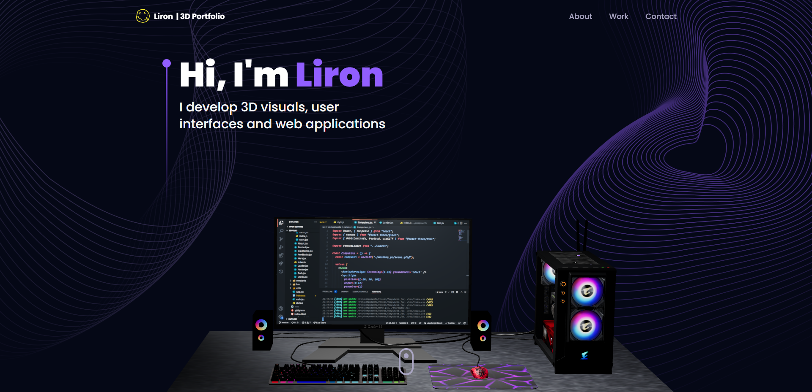

 

<!-- About the Project -->

##  About the Project

  

 

This repository houses an well-designed and functional Developer Portfolio Website consisting Navbar, Hero, Overview, Work Experience, Technologies, Projects, Testimonials and Contact sections built with React & Three.js using TailwindCSS ⏭

<!-- Folder Structure -->

<!-- TechStack -->

### :space_invader: Tech Stack

